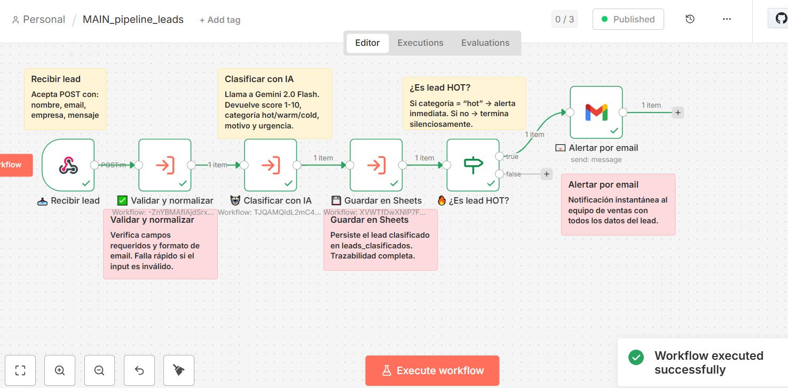
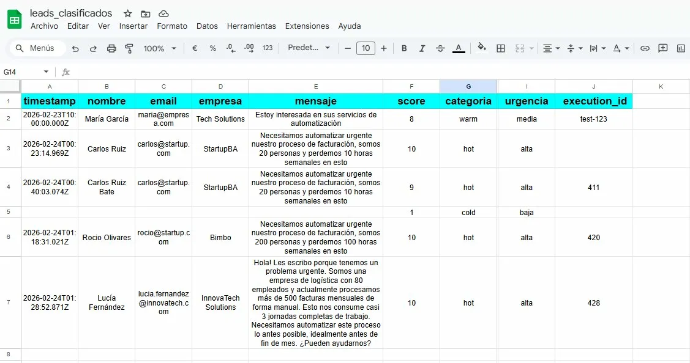
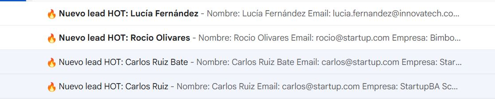

# 🚀 n8n Lead Pipeline — Clasificación inteligente de leads con IA

Pipeline de automatización para captura, validación y clasificación de leads comerciales usando n8n + Gemini AI + Google Sheets.


## ¿Qué hace?

Recibe un lead via webhook → lo valida → lo clasifica con IA (hot/warm/cold) → lo guarda en Google Sheets → notifica por email si es HOT.





## Resultados en tiempo real


### 📊 Leads clasificados en Google Sheets



### 📧 Alertas automáticas por email



```
[Webhook POST] 
    → [SW_01] Validar y normalizar input
    → [SW_02] Clasificar con Gemini AI
    → [SW_03] Persistir en Google Sheets
    → [IF categoria = "hot"] → Notificación Gmail
```

## Stack

- **n8n** — motor de automatización
- **Gemini 2.0 Flash** (Google AI) — clasificación de leads
- **Google Sheets** — almacenamiento y log
- **Gmail** — notificaciones de leads calientes

## Estructura del proyecto

```
n8n-lead-pipeline/
├── workflows/
│   ├── SW_01_validar_normalizar_input.json
│   ├── SW_02_clasificar_con_IA.json
│   ├── SW_03_persistir_log.json
│   └── MAIN_pipeline_leads.json
├── .env.example
├── .gitignore
└── README.md
```

## Setup en 5 minutos

### 1. Prerrequisitos
- n8n Cloud o self-hosted (v1.0+)
- API Key de Google Gemini → [obtener acá](https://aistudio.google.com/app/apikey)
- Cuenta de Google con acceso a Sheets y Gmail

### 2. Crear Google Sheets

Crear dos spreadsheets en Google Drive:

**`leads_clasificados`** con columnas:
```
timestamp | nombre | email | empresa | mensaje | score | categoria | motivo | urgencia | execution_id
```

**`error_log`** con columnas:
```
timestamp | workflow | node | error_message | execution_id | input_data
```

### 3. Configurar credenciales en n8n

| Credencial | Tipo | Dónde se usa |
|-----------|------|-------------|
| Gemini API Key | Query Auth (`key`) | SW_02 |
| Google Sheets | OAuth2 | SW_03 |
| Gmail | OAuth2 | MAIN |

### 4. Importar workflows

Importar en este orden:
1. `SW_01_validar_normalizar_input.json`
2. `SW_02_clasificar_con_IA.json`
3. `SW_03_persistir_log.json`
4. `MAIN_pipeline_leads.json`

### 5. Actualizar IDs en el MAIN

En `MAIN_pipeline_leads`, reemplazar los placeholders con los IDs reales:
- `SW_01_ID_HERE` → ID del workflow SW_01
- `SW_02_ID_HERE` → ID del workflow SW_02  
- `SW_03_ID_HERE` → ID del workflow SW_03
- `YOUR_GOOGLE_SHEET_ID` → ID de tu spreadsheet `leads_clasificados`
- `YOUR_EMAIL@gmail.com` → tu email para notificaciones

### 6. Activar y probar

Activar el MAIN y hacer un POST de prueba:

```bash
curl -X POST https://TU-INSTANCIA.n8n.cloud/webhook/pipeline-leads \
  -H "Content-Type: application/json" \
  -d '{
    "nombre": "Carlos Ruiz",
    "email": "carlos@startup.com",
    "empresa": "StartupBA",
    "mensaje": "Necesitamos automatizar urgente nuestro proceso de facturación, somos 20 personas"
  }'
```

## Clasificación de leads

Gemini clasifica cada lead según:

| Categoría | Score | Significado |
|-----------|-------|-------------|
| `hot` | 8-10 | Urgencia alta, intención clara → notificación inmediata |
| `warm` | 5-7 | Interés moderado, seguimiento recomendado |
| `cold` | 1-4 | Sin urgencia o intención difusa |

## Variables de entorno

Copiar `.env.example` a `.env` y completar:

```bash
cp .env.example .env
```

```env
GEMINI_API_KEY=your_gemini_api_key_here
N8N_WEBHOOK_URL=https://your-instance.n8n.cloud
NOTIFICATION_EMAIL=your@email.com
```

## Arquitectura de sub-workflows

La modularidad permite reutilizar cada componente de forma independiente:

- **SW_01** — reutilizable para cualquier pipeline que necesite validar inputs
- **SW_02** — reutilizable para clasificar cualquier texto con IA
- **SW_03** — reutilizable para persistir cualquier dataset en Sheets

---

## Author

Maria Fernanda Moreno

Automation Developer  
AI Automation Specialist  
n8n Developer  

> Showcase de proyectos: https://showcase-de-automatizaciones-y-webs.vercel.app/
---

